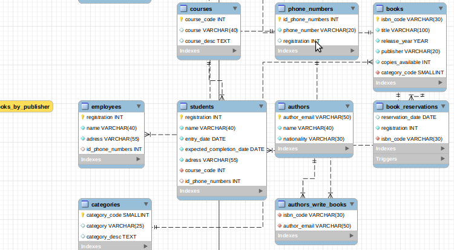

# college-library-db

> Based on an evaluative work by the faculty, this repository contains an application that simulates a 
> college library, with three levels of access (users, administrators and librarians).

### Adjustments and improvements

The project is still under development and the next updates will focus on the following tasks:

- [x] Write database SQL script
- [x] Establish Python and MySQL communication
- [ ] Implement interaction screens

## 💻 Prerequisites

Before starting, make sure you've met the following requirements:
<!---These are example requirements only. Add, duplicate or remove as needed--->
* Latest version of Python
* Windows, Mac or Linux, as long as you have an interpreter

## 📫 Contributing to college-library-db
<!---If your README is long or if you have any specific process or steps you want contributors to follow, consider creating a separate CONTRIBUTING.md file--->
To contribute to college-library-db, follow these steps:

1. Fork this repository.
2. Create a branch: `git checkout -b <branch_name>`.
3. Make your changes and commit them: `git commit -m '<message_commit>'`
4. Push to the original branch: `git push origin <project_name> / <local>`
5. Create the pull request.

Alternatively, see the GitHub documentation at [how to create a pull request](https://help.github.com/en/github/collaborating-with-issues-and-pull-requests/creating-a-pull-request ).

## 📝 License

This project is under license. See the [LICENSE](LICENSE.md) file for more details.

[⬆ Back to top](#college-library-db) 
